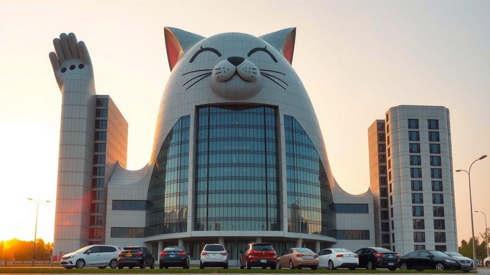
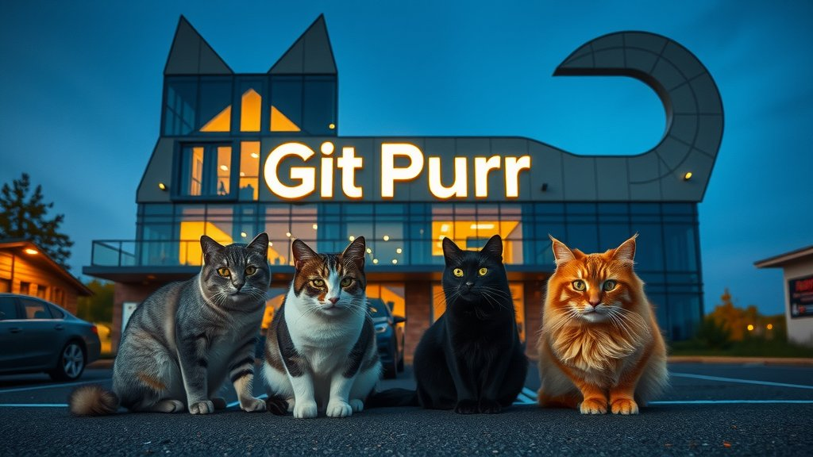

# 🐈 GitPurr

**GitPurr** is an organization for cats of all types.  
Are you an ordinary cat? Maybe you're a robot cat? Or perhaps an ordinary cat doing work like a robot?  
It doesn't matter; there's a place for you here. **Join us today** 🐱

# ✨ Benefits

- **Catnip Thursdays** - Every Thursday, the office will provide a special treat of catnip for members to enjoy. Participation is optional but highly recommended for stress relief.
- **Mandatory Nap Time** - Cats are experts at sleeping up to 15 hours a day. Employees are encouraged to follow their lead and take regular power naps at their desks to recharge.
- **Laser Pointer Training** - Employees will be trained on how to effectively use laser pointers to motivate and engage their feline coworkers. Pointing skills are essential for meetings and presentations.

# 📃 Office Rules
1. **No dogs allowed** - This is a cat-only workplace. Barking, chasing, or harassing our feline coworkers will not be tolerated.
2. **Catnip is encouraged** - Members are welcome to bring their own catnip to work. Sharing is caring, so be generous with your stash.
3. **Laser pointers are mandatory** - All employees must carry a laser pointer at all times for motivating and entertaining our cat coworkers. Pointing skills will be tested.
4. **Nap time is sacred** - Quiet hours are from 1-3 pm daily for mandatory napping. Loud noises, bright lights, and excessive petting are prohibited during this time.
5. **Curiosity is not a crime** - Knocking over office supplies, chasing office supplies, and batting at office supplies is all part of the job. Embrace your inner kitten.
6. **Hairballs are not acceptable** - If you must vomit, please do so in the potted plants, not on the carpet. Cleaning supplies will not be provided.
7. **No rush allowed** - Slow down and smell the catnip. Deadlines are more like guidelines in a cat-centric world. Purr-fection takes time.
8. **Curiosity may kill the cat** - Climbing on high shelves, jumping from desk to desk, and chasing laser pointers into the street is at your own risk. The company is not liable for feline mishaps.

# ✉️ Contact

### `Headquarters` 9 Purr Lane, Meowing, Catifornia, 13134

### `Field Office` 128 Whiskers Lane, Kittytown, Pawshington, 21337

